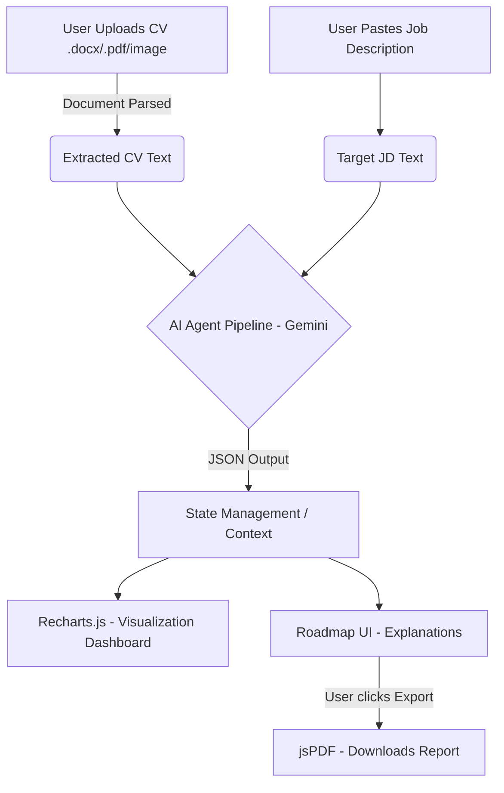

<div align="center">

</div>

# ⚡ SkillBridge 
An AI-powered skill gap analysis platform that compares your skills against job descriptions to provide explainable readiness insights and learning paths.

## Overview
**SkillBridge** is an AI-powered employability platform designed to solve a critical issue in today's job market: the gap between a candidate's motivation and the opaque, highly variable expectations of employers.
The system analyzes user skills against real job requirements, identifies skill gaps, explains readiness levels, and generates a personalized learning path to help users move closer to employment.

## Features
- **Intelligent Document Parsing:** Seamlessly extract text from uploaded resumes and custom job descriptions.
- **Explainable Readiness Scoring:** Calculates an accurate job-fit metric based on the formula: `(Matched Skills ÷ Total Required Skills) × 100`.
- **Semantic Skill Matching:** Goes beyond basic keyword matching by understanding context and synonyms using AI reasoning.
- **Interactive Analytics Dashboard:** Visualizes matched skills, missing skills, and overall readiness using dynamic charts.
- **Personalized Learning Roadmap:** Generates a step-by-step, actionable study plan tailored to the user's specific skill gaps.
- **Exportable Reports:** Allows users to download their readiness assessment and learning roadmap as a clean, formatted PDF document.
- **Modern, Accessible UI:** A highly responsive, intuitive interface built with React and beautiful iconography.

## Tech Stack
- **Frontend Framework** - React.js (Vite/Next.js recommended)
- **AI Engine** — Google Gemini Reasoning API (For advanced semantic analysis and roadmap generation)
- **Document Parsing** — Mammoth.js (For extracting raw text from .docx files)
- **Data Visualization** — Recharts.js (For rendering the Readiness Score gauge and skill gap radars)
- **PDF Generation** — jsPDF (For exporting offline career roadmaps)
- **UI Iconography** — Lucide-React (For clean, consistent UI components)

## Architecture
The SkillBridge architecture follows a linear, client-driven pipeline where data flows from the user interface, through local parsing, into the AI reasoning engine, and back to the visualization layer.

- **Input Layer:** Users interact with the React UI to upload their `.docx/.pdf/image` CV (parsed entirely in-browser) and input their target Job Description.
- **Processing Layer:** The extracted text is combined into a structured prompt and sent to the Gemini API.
- **Reasoning Layer:** Gemini acts as a multi-agent system (see below) to analyze, score, and advise.
- **Presentation Layer:** The JSON response from Gemini is mapped to the React UI. Data is visualized using Recharts, decorated with Lucide-react icons, and can be exported via jsPDF.

## Agent Breakdown (Gemini Reasoning Pipeline)
Instead of a single, massive prompt, SkillBridge utilizes the Gemini Reasoning capabilities by structuring the AI's tasks into three distinct logical "Agents." This ensures high accuracy, explainability, and structured JSON outputs.

**1. The Extraction Agent:**
- **Input:** Raw text from Mammoth.js (CV) and user-provided JD.
- **Task:** Normalizes unstructured text. Identifies and lists technical skills, soft skills, and experience levels from both documents.
- **Output:** Two clean arrays of skills (User Skills & Required Skills). Handles the variety and ambiguity of language (e.g., recognizing that "ReactJS" and "React.js" are the same).
 
**2. The Evaluation Agent:**
- **Input:** The normalized skill arrays from the Extraction Agent.
- **Task:** Performs deep semantic matching. It categorizes skills into Matched, Missing, and Transferable. It calculates the core metric: `Readiness Score = (Matched Skills ÷ Total Required Skills) × 100`
- **Output:** Structured scoring data mapped directly into Recharts.js for immediate visual feedback (e.g., Donut charts for score, Radar charts for skill coverage).
  
**3. The Career Coach Agent:**
- **Input:** The calculated skill gaps and the target company's industry context.
- **Task:** Formulates a personalized, explainable learning path. It breaks down the missing skills into actionable steps (e.g., "Week 1: Focus on learning X to satisfy requirement Y").
- **Output:** A step-by-step roadmap rendered in the UI, which is then passed to jsPDF when the user requests a downloadable action plan.

## Run Locally

**Prerequisites:**  Node.js, A Google Gemini API Key

**Installation:**
```
git clone https://github.com/YOUR_USERNAME/SkillBridge.git
cd SkillBridge
# This will install React, mammoth, recharts, jspdf, lucide-react, etc.
```

1. Install dependencies:
   `npm install`
2. Set the `GEMINI_API_KEY` in [.env.local](.env.local) to your Gemini API key
3. Run the app:
   `npm run dev`

## 🤝 Contributing
Contributions make the open-source community an amazing place to learn, inspire, and create. Any contributions you make are greatly appreciated.
- Fork the Project
- Create your Feature Branch (git checkout -b feature/AmazingFeature)
- Commit your Changes (git commit -m 'Add some AmazingFeature')
- Push to the Branch (git push origin feature/AmazingFeature)
- Open a Pull Request

## 📄 License
Distributed under the MIT License. See `LICENSE` for more information.

