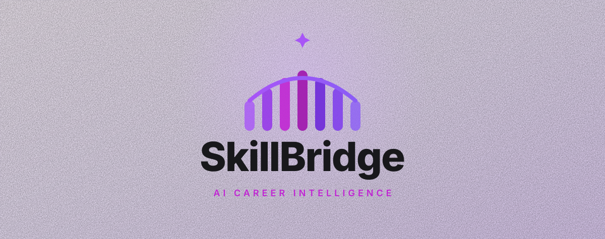
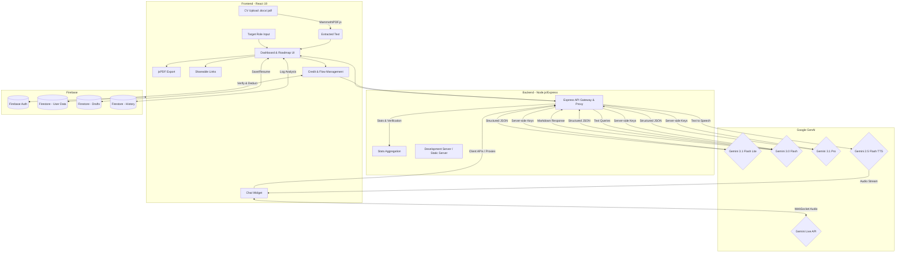

<div align="center">
<picture>
  <source media="(prefers-color-scheme: dark)" srcset="./public/logo-dark.svg">
  
</picture>
</div>

# ⚡ SkillBridge 

<p align="center">
  <b>An AI-powered skill gap analysis platform and 24/7 career coach.</b><br>
  <i>Compare your skills against job descriptions, get explainable readiness insights, and receive real-time career guidance.</i><br>
  <br>
  🔗 <b>Live Demo:</b> <a href="https://skillbridge-prod.vercel.app/">skillbridge-prod.vercel.app</a>
</p>

---

## 📖 Overview

**SkillBridge** is an open-source, end-to-end employability platform designed to solve a critical issue in today's job market: the "ATS Black Hole" and the high cost of professional career coaching. 

In a world where hundreds of resumes are submitted for a single role, standing out requires knowing exactly what you're missing. SkillBridge acts as your **personal, 24/7 AI career coach**. By leveraging the power of Google's multi-model Gemini architecture, it intelligently parses your resume, compares it against your dream job description, and provides a deeply analytical, explainable **Readiness Score**.

But it doesn't stop at scoring. SkillBridge generates a **highly personalized, step-by-step learning roadmap** to help you bridge your specific skill gaps. Whether you are a recent graduate trying to land your first tech role, a professional pivoting to a new industry, or a senior engineer aiming for staff level, SkillBridge gives you the actionable insights you need to upskill efficiently.

### ✨ Why SkillBridge?
* **Stop Guessing:** Get concrete data on why your resume might be getting rejected.
* **Upskill Smartly:** Don't learn everything—learn exactly what the job description is asking for.
* **Ace the Interview:** Use the built-in AI Voice Interviewer to practice your pitch in real-time.
* **Own Your Growth:** Save your analysis drafts, track your progress over time, and export your roadmaps to PDF.

## Features
- **Intelligent Document Parsing:** Seamlessly extract text from uploaded resumes (PDF & DOCX) and custom job descriptions.
- **Save & Manage Drafts:** Never lose your progress. Save your analysis at any stage, manage your drafts, and easily resume or delete them from your dashboard.
- **Analysis History & Tracking:** Automatically securely log your history with option to delete analyses.
- **Credit Engine:** Custom credit usage and purchase flows powered by seamless token tracking.
- **Community Testimonials:** Full mobile-responsive UI with user testimonials from successful candidates, stored in Firebase.
- **Shareable Analysis Results:** Generate unique links to share your readiness reports and career roadmaps with mentors or recruiters.
- **Interactive AI Career Coach:** A built-in chat widget for contextual career advice, salary trends, and resume tips with Search Grounding. Manage your conversations easily with the ability to delete individual messages, clear your entire chat history to reset the AI's memory, and enjoy a fully scrollable Voice Mode interface.
- **Explainable Readiness Scoring:** Calculates an accurate job-fit metric based on advanced AI reasoning.
- **Personalized Learning Roadmap:** Generates a step-by-step, actionable study plan tailored to your specific skill gaps.
- **Exportable PDF Reports:** Download high-quality, professionally formatted PDF reports of your analysis.
- **Modern Purplish UI:** A sleek, eye-pleasing interface built with React 19, Tailwind CSS, and Framer Motion, featuring a refined purple-themed palette.
- **Secure Auth & Credit System:** Powered by Firebase to securely manage user sessions and track API usage.

## Tech Stack
- **Frontend Framework:** React 19, Vite, Tailwind CSS, Framer Motion
- **Backend & Cloud:** Node.js, Express, Vercel (Serverless Hosting)
- **Database & Auth:** Firebase Authentication, Cloud Firestore
- **AI Engine:** Google GenAI SDK (Gemini 3.1 Flash Lite, Gemini 3.0 Flash, Gemini 3.1 Pro)
- **Document Parsing:** Mammoth.js (DOCX), pdfjs-dist (PDF)
- **Data Visualization:** Recharts.js (For rendering the Readiness Score gauge)
- **PDF Generation:** jsPDF (For exporting offline career roadmaps)
- **UI Iconography:** Lucide-React

## Architecture
The SkillBridge architecture follows a modern full-stack pipeline. The React frontend handles local document parsing, state management, and UI, while the Node.js/Express backend securely constructs API requests for Firebase, tracks platform statistics, and directly proxy interfaces with Google's GenAI models.


```mermaid
graph TD;
    subgraph Client [Frontend - React 19]
        A[CV Upload .docx/.pdf] -->|Mammoth/PDF.js| B(Extracted Text)
        C[Target Role Input]
        J[Chat Widget]
        UI[Dashboard & Roadmap UI]
        Export[jsPDF Export]
        Share[Shareable Links]
        Credits[Credit & Flow Management]
    end

    subgraph Server [Backend - Node.js/Express]
        API[Express API Gateway & Proxy]
        Stats[Stats Aggregation]
        Vite[Development Server / Static Server]
    end

    subgraph Database [Firebase]
        Auth[(Firebase Auth)]
        DB[(Firestore - User Data)]
        Drafts[(Firestore - Drafts)]
        History[(Firestore - History)]
    end

    subgraph AI [Google GenAI]
        G_Lite{Gemini 3.1 Flash Lite}
        G_Flash{Gemini 3.0 Flash}
        G_Pro{Gemini 3.1 Pro}
        G_TTS{Gemini 2.5 Flash TTS}
        G_Live{Gemini Live API}
    end

    %% Authentication & Database
    Client <-->|Login / Session| Auth
    UI <-->|Save/Resume| Drafts
    UI <-->|Log Analysis| History
    Credits <-->|Verify & Deduct| DB

    %% Core Analysis Flow
    B --> UI
    C --> UI
    UI --> Credits
    Credits --> API
    API -->|Stats & Verification| Stats
    API -->|Server-side Keys| G_Lite
    API -->|Server-side Keys| G_Flash
    API -->|Server-side Keys| G_Pro
    G_Lite -->|Structured JSON| API
    G_Flash -->|Structured JSON| API
    G_Pro -->|Structured JSON| API
    API --> UI
    UI --> Export
    UI --> Share

    %% Chat & Voice Flow
    J -->|Client APIs / Proxies| API
    API -->|Text Queries| G_Flash
    G_Flash -->|Markdown Response| API
    API -->|Text to Speech| G_TTS
    G_TTS -->|Audio Stream| J
    J <-->|WebSocket Audio| G_Live
```

## Multi-Model AI Architecture (Gemini Pipeline)
Instead of relying on a single model, SkillBridge orchestrates multiple Google Gemini models based on task complexity to optimize for speed, cost, and user experience.

**1. The Parsing & Analysis Agents (Gemini 3.1 Flash Lite / 3.0 Flash / 3.1 Pro):**
- **Input:** Raw text from Mammoth.js/PDF.js (CV) and user-provided target role.
- **Task:** Rapidly normalizes unstructured text. Identifies technical skills, soft skills, and experience levels. Performs deep semantic matching to calculate the Readiness Score and generate the step-by-step learning roadmap. Users can select the model speed (Fastest, Balanced, Deep) to balance cost and reasoning depth.
- **Output:** Structured JSON scoring data mapped directly into Recharts.js and the Roadmap UI.
 
**2. The Career Coach Agent (Gemini Flash Latest):**
- **Input:** User chat queries and the context of their analyzed CV/Roadmap.
- **Task:** Provides deep, contextual text-based advice on industry trends, resume optimization, and interview preparation using Search Grounding.
- **Output:** Markdown-formatted chat responses rendered in the interactive Chat Widget.
  
**3. The Voice Agent (Gemini 2.5 Flash TTS):**
- **Input:** Text generated by the Career Coach or Analysis summary.
- **Task:** Converts text to natural-sounding speech for an accessible and engaging user experience.
- **Output:** High-quality audio playback in the browser.

**4. The Interviewer Agent (Gemini Live API):**
- **Input:** Real-time user audio via the Web Audio API.
- **Task:** Acts as a human recruiter. Listens to the user's answers, interrupts gracefully if needed, and provides spoken feedback on behavioral and technical questions.
- **Output:** Low-latency, bidirectional voice streaming for a natural mock interview experience.

## Run Locally

**Prerequisites:** Node.js, A Google Gemini API Key, A Firebase Project

**Installation:**
```bash
git clone https://github.com/YOUR_USERNAME/SkillBridge.git
cd SkillBridge
```

1. Install dependencies:
   ```bash
   npm install
   ```
2. Create a `.env` (if not existing) file in the root directory and add your API keys:
   ```env
   GEMINI_API_KEY=your_gemini_api_key_here
   VITE_FIREBASE_API_KEY=your_firebase_api_key
   VITE_FIREBASE_AUTH_DOMAIN=your_firebase_auth_domain
   VITE_FIREBASE_PROJECT_ID=your_firebase_project_id
   VITE_FIREBASE_STORAGE_BUCKET=your_firebase_storage_bucket
   VITE_FIREBASE_MESSAGING_SENDER_ID=your_firebase_messaging_sender_id
   VITE_FIREBASE_APP_ID=your_firebase_app_id
   VITE_FIREBASE_FIRESTORE_DATABASE_ID=your_firebase_firestore_database_id
   VITE_FIREBASE_MEASUREMENT_ID=your_firebase_measurement_id
   ```
   **Note:** 
   > * `VITE_FIREBASE_MEASUREMENT_ID` is optional and only required if you want to enable Google Analytics for your Firebase project.
   > * To find your `VITE_FIREBASE_FIRESTORE_DATABASE_ID`: Go to the Firebase Console -> Build -> Firestore Database. If you are using the default database, the ID is usually `(default)`. If you created a named database, use that specific name.
   
3. Run the development server:
   ```bash
   npm run dev
   ```

## 🤝 Contributing
Contributions make the open-source community an amazing place to learn, inspire, and create. Any contributions you make are greatly appreciated.
- Fork the Project
- Create your Feature Branch (`git checkout -b feature/AmazingFeature`)
- Commit your Changes (`git commit -m 'Add some AmazingFeature'`)
- Push to the Branch (`git push origin feature/AmazingFeature`)
- Open a Pull Request

## 📄 License
Distributed under the MIT License. See `LICENSE` for more information.
