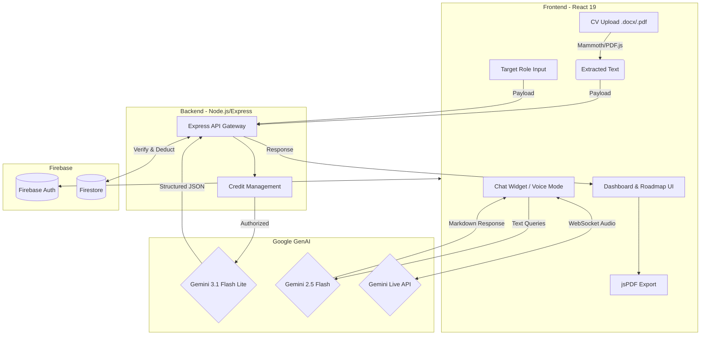

<div align="center">

</div>

# ⚡ SkillBridge 
An AI-powered skill gap analysis platform and 24/7 career coach that compares your skills against job descriptions, provides explainable readiness insights, and conducts real-time voice mock interviews.

## Overview
**SkillBridge** is an end-to-end employability platform designed to solve a critical issue in today's job market: the "ATS Black Hole" and the high cost of professional career coaching. 
The system analyzes user skills against real job requirements, identifies skill gaps, explains readiness levels, generates a personalized learning path, and allows users to practice their interview skills in real-time using advanced AI voice models.

## Features
- **Intelligent Document Parsing:** Seamlessly extract text from uploaded resumes (PDF & DOCX) and custom job descriptions.
- **Live Voice Mock Interviews:** Toggle "Live Voice Mode" to conduct real-time, low-latency mock interviews and practice the STAR method out loud using the Gemini Live API.
- **Interactive AI Career Coach:** A built-in chat widget for contextual career advice, salary trends, and resume tips.
- **Explainable Readiness Scoring:** Calculates an accurate job-fit metric based on the formula: `(Matched Skills ÷ Total Required Skills) × 100`.
- **Semantic Skill Matching:** Goes beyond basic keyword matching by understanding context and synonyms using AI reasoning.
- **Personalized Learning Roadmap:** Generates a step-by-step, actionable study plan tailored to your specific skill gaps.
- **Exportable Reports:** Download your readiness assessment, learning roadmap, and chat history as a clean, formatted PDF document.
- **Secure Auth & Credit System:** Powered by Firebase to securely manage user sessions and track API usage.
- **Modern, Accessible UI:** A highly responsive, intuitive interface built with React 19, Tailwind CSS, and Framer Motion.

## Tech Stack
- **Frontend Framework:** React 19, Vite, Tailwind CSS, Framer Motion
- **Backend & Cloud:** Node.js, Express, Vercel (Serverless Hosting)
- **Database & Auth:** Firebase Authentication, Cloud Firestore
- **AI Engine:** Google GenAI SDK (Gemini 3.1 Flash Lite, Gemini 2.5 Flash, Gemini Live API)
- **Document Parsing:** Mammoth.js (DOCX), pdfjs-dist (PDF)
- **Data Visualization:** Recharts.js (For rendering the Readiness Score gauge and skill gap radars)
- **PDF Generation:** jsPDF (For exporting offline career roadmaps and chat histories)
- **UI Iconography:** Lucide-React

## Architecture
The SkillBridge architecture follows a modern full-stack pipeline. The React frontend handles local document parsing and UI state, while the Node.js/Express backend securely manages API requests, Firebase authentication, and credit tracking before interfacing with the Google GenAI models.


```mermaid
graph TD;
    subgraph Client [Frontend - React 19]
        A[CV Upload .docx/.pdf] -->|Mammoth/PDF.js| B(Extracted Text)
        C[Target Role Input]
        J[Chat Widget / Voice Mode]
        UI[Dashboard & Roadmap UI]
        Export[jsPDF Export]
    end

    subgraph Server [Backend - Node.js/Express]
        API[Express API Gateway]
        Credits[Credit Management]
    end

    subgraph Database [Firebase]
        Auth[(Firebase Auth)]
        DB[(Firestore)]
    end

    subgraph AI [Google GenAI]
        G_Lite{Gemini 3.1 Flash Lite}
        G_Flash{Gemini 2.5 Flash}
        G_Live{Gemini Live API}
    end

    %% Authentication & Credits
    Client <-->|Login / Token| Auth
    API <-->|Verify & Deduct| DB

    %% Core Analysis Flow
    B -->|Payload| API
    C -->|Payload| API
    API --> Credits
    Credits -->|Authorized| G_Lite
    G_Lite -->|Structured JSON| API
    API -->|Response| UI
    UI --> Export

    %% Chat & Voice Flow
    J -->|Text Queries| G_Flash
    J <-->|WebSocket Audio| G_Live
    G_Flash -->|Markdown Response| J
```

## Multi-Model AI Architecture (Gemini Pipeline)
Instead of relying on a single model, SkillBridge orchestrates multiple Google Gemini models based on task complexity to optimize for speed, cost, and user experience.

**1. The Parsing & Analysis Agent (Gemini 3.1 Flash Lite):**
- **Input:** Raw text from Mammoth.js/PDF.js (CV) and user-provided target role.
- **Task:** Rapidly normalizes unstructured text. Identifies technical skills, soft skills, and experience levels. Performs deep semantic matching to calculate the Readiness Score and generate the step-by-step learning roadmap.
- **Output:** Structured JSON scoring data mapped directly into Recharts.js and the Roadmap UI.
 
**2. The Career Coach Agent (Gemini 2.5 Flash):**
- **Input:** User chat queries and the context of their analyzed CV/Roadmap.
- **Task:** Provides deep, contextual text-based advice on industry trends, resume optimization, and interview preparation.
- **Output:** Markdown-formatted chat responses rendered in the interactive Chat Widget.
  
**3. The Interviewer Agent (Gemini Live API):**
- **Input:** Real-time user audio via the Web Audio API.
- **Task:** Acts as a human recruiter. Listens to the user's answers, interrupts gracefully if needed, and provides spoken feedback on behavioral and technical questions.
- **Output:** Low-latency, bidirectional voice streaming for a natural mock interview experience.

## Run Locally

**Prerequisites:** Node.js, A Google Gemini API Key, A Firebase Project

**Installation:**
```bash
git clone https://github.com/YOUR_USERNAME/SkillBridge.git
cd SkillBridge
```

1. Install dependencies:
   ```bash
   npm install
   ```
2. Create a `.env` file (if not existing) in the root directory and add your API keys:
   ```env
   VITE_GEMINI_API_KEY=your_gemini_api_key_here
   VITE_FIREBASE_API_KEY=your_firebase_api_key
   VITE_FIREBASE_AUTH_DOMAIN=your_firebase_auth_domain
   VITE_FIREBASE_PROJECT_ID=your_firebase_project_id
   VITE_FIREBASE_STORAGE_BUCKET=your_firebase_storage_bucket
   VITE_FIREBASE_MESSAGING_SENDER_ID=your_firebase_messaging_sender_id
   VITE_FIREBASE_APP_ID=your_firebase_app_id
   ```
3. Run the development server:
   ```bash
   npm run dev
   ```

## 🤝 Contributing
Contributions make the open-source community an amazing place to learn, inspire, and create. Any contributions you make are greatly appreciated.
- Fork the Project
- Create your Feature Branch (`git checkout -b feature/AmazingFeature`)
- Commit your Changes (`git commit -m 'Add some AmazingFeature'`)
- Push to the Branch (`git push origin feature/AmazingFeature`)
- Open a Pull Request

## 📄 License
Distributed under the MIT License. See `LICENSE` for more information.
